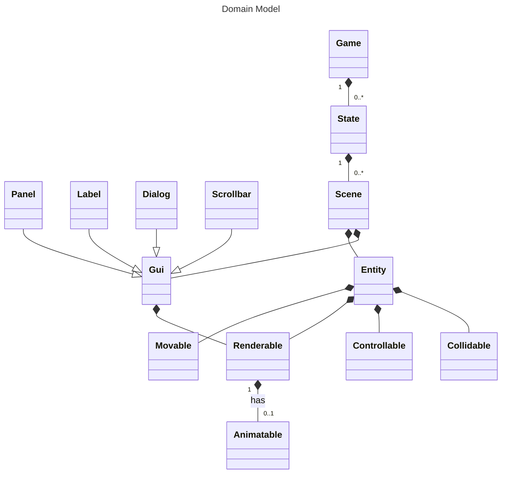
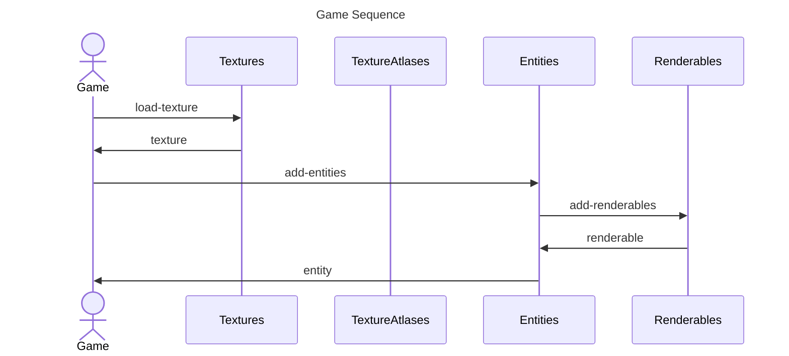

```mermaid
---
title: Domain Model
---
classDiagram
  Entity *-- Movable
  Entity *-- Renderable
  Renderable "1" *-- "0..1" Animatable : has
  Entity *-- Controllable
  Entity *-- Collidable

  Panel --|> Gui
  Label --|> Gui
  Dialog --|> Gui
  Scrollbar --|> Gui

  Gui *-- Renderable
  
  Game "1" *-- "0..*" State
  State "1" *-- "0..*" Scene
  Scene *-- Entity
  Scene *-- Gui

  Textures
  TextureAtlases

```

```mermaid

---
title: Game Sequence
---
sequenceDiagram
  actor Game
  
  participant Textures
  participant TextureAtlases
  participant Entities
  participant Renderables

  Game ->> Textures: load-texture
  Textures ->> Game: texture
  Game ->> Entities: add-entities
  Entities ->> Renderables: add-renderables
  Renderables ->> Entities: renderable
  Entities ->> Game: entity
```
